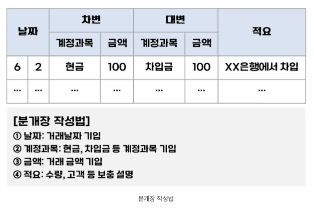
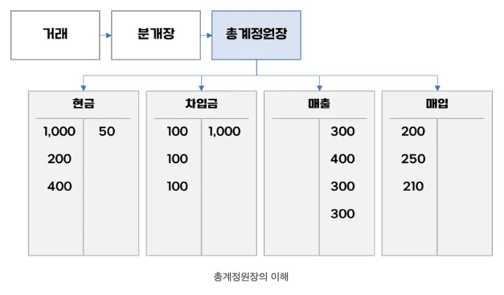
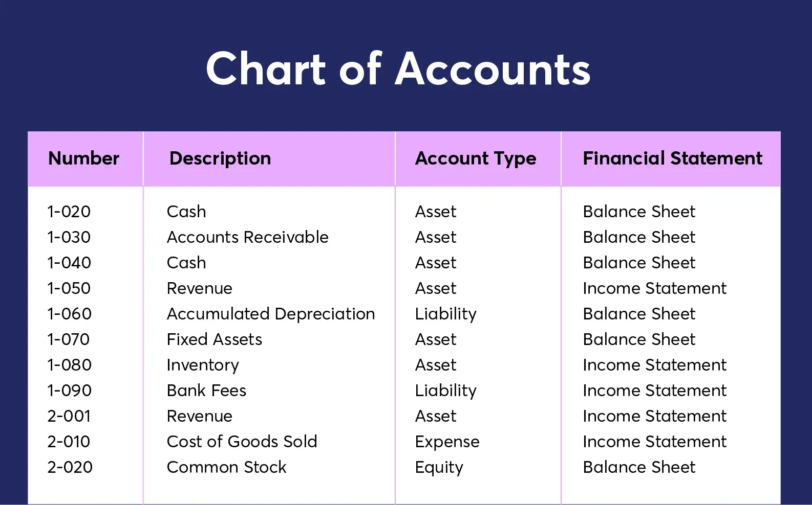

# 회계 관련 기본 개념

### Journal(분개장)



> [https://doitevery.com/entry/분개장과-총계정원장](https://doitevery.com/entry/분개장과-총계정원장)

### General Ledger(총계정원장)



> [https://doitevery.com/entry/분개장과-총계정원장](https://doitevery.com/entry/분개장과-총계정원장)

---

# 📘 총계정원장 데이터

### 총계정원장의 개요

- 총계정원장은 **회계 데이터를 통합**하는 중심 시스템이다.
- 분리된 시스템(구매, 미지급금, 세부원장 등)으로부터 정보를 받아 **한데 모은다**.
- 총계정원장을 모델링할 때는 보통 두 가지 팩트 테이블 설계 필요
    - ✅ **트랜잭션 팩트 테이블 (Transactional Fact Table)**: 상세 회계 이벤트 중심
    - ✅ **주기적 스냅샷 팩트 테이블 (Periodic Snapshot Fact Table)**: 월말 잔액 중심

### Transactional Fact Table (`fact__accounting`)

| **date** | **datetime** | **ledger** | **account** | **organization** | **debit_credit** | **amount** | **…** |
| --- | --- | --- | --- | --- | --- | --- | --- |
| **2025-02-01** | 2025-02-01 11:00:00 | 현금및현금성자산 | 시티은행 입출금 계좌 | 자산팀 | debit | 100 | … |
| **2025-02-02** | 2025-02-02 10:00:00 | 매출 | 한국 매출 | 세일즈팀 | credit | 50 | … |
| … | … | … | … | … | … | … | … |

### Periodic Snapshot Fact Table (`monthly_snapshot__accounting`)

```sql
-- Incremental Strategy는 고려하지 않고 대강 적어봄

with
current_month as (
    select
        cast(format_date('%Y%m', date) as int64) as month,
        ledger,
        account,
        organization,
        sum(case when debit_credit = 'debit' then amount end) as debit,
        sum(case when debit_credit = 'credit' then amount end) as credit,
        sum(case when debit_credit = 'debit' then amount end) - sum(case when debit_credit = 'credit' then amount end) as net_change,
    from
        fact_accounting
    where true
        and date_trunc(date, month) = '2025-02-01'
    group by
        all
)

select
    month,
    coalesce(prev.ledger, curr.ledger) as ledger,
    coalesce(prev.account, curr.account) as account,
    coalesce(prev.organization, curr.organization) as organization,
    coalesce(prev.balance, 0) + curr.net_change as balance,
    curr.debit,
    curr.credit,
    curr.net_change,
from
    previous_month as prev
where true
    and prev.month = 202501
full outer join
    current_month as curr
    on prev.ledger = curr.ledger and prev.account = curr.account and prev.organization = curr.organization
```

**🔹 비즈니스 프로세스**: 총계정원장 자체가 비즈니스 프로세스

**🔹 그레인(Grain)**: 각 **회계 주기(예: 월말)** 마다, 각 **계정** 단위로 **잔액을 기록한 한 줄(Row)**

| month | **ledger** | **account** | **organization** | **balance** | **debit** | **credit** | **net_change** |
| --- | --- | --- | --- | --- | --- | --- | --- |
| **202502** | 현금및현금성자산 | 시티은행 입출금 계좌 | 자산팀 | 5,000 | 5,000 | 2,000 | 3,000 |
| **202502** | 매출 | 한국 매출 | 세일즈팀 | -4,000 | 0 | 1,000 | -1,000 |
| **202502** | 재고자산 | 아이폰 | 구매팀 | 300 | 500 | 200 | 300 |
| **202502** | 차입금 | 단기차입금 | 자금팀 | -8,000 | 0 | 5,000 | -5,000 |
| … | … | … | … | … | … | … | … |

### 계정과목 총괄표(Chart of Accounts, CoA)

☀️ **Dimension** 역할을 한다! (특별할 게 없음 🤷🏻‍♂️)



> [https://www.waveapps.com/blog/chart-of-accounts](https://www.waveapps.com/blog/chart-of-accounts)

### 📌 주의할 점

**📍 순 변화만 기록**: Periodic Snapshot은 누적값이 아니라, 순 변화 중심으로 기록

<aside>
☝🏻

**진석 생각**

다음과 같이, 누적 사용자 수, 누적 매출액, 누적 판매 수 등을 Snapshot Fact 테이블로 관리하면, 사용성이 굉장히 제한적일 수밖에 없음

(항상, 해당 Period 동안 발생한 것에 초점을 두는 게 확장성 측면에서 좋음)

</aside>

| **date** | **cum_users** | **cum_revenue** | **cum_transactions** |
| --- | --- | --- | --- |
| 2025-01-01 | 1,000,000 | $50,000 | 500 |
| 2025-01-02 | 1,100,100 | $51,000 | 502 |
| … | … | … | … |

| **date** | **new_users** | **revenue** | **transactions** |
| --- | --- | --- | --- |
| 2025-01-01 | 50 | $900 | 5 |
| 2025-01-02 | 100 | $1,000 | 2 |
| … |  | … | … |

```sql
select
    date,
    sum(new_users) over (order by date rows between unbounded preceding and current row) as cum_users,
    sum(revenue) over (order by date rows between unbounded preceding and current row) as cum_revenue,
    sum(transactions) over (order by date rows between unbounded preceding and current row) as cum_transactions, 
from
    daily_snapshot__key_metrics
```

**📍 각 항목은 철저히 Unit Transaction으로 기록:** 하나의 항목이 **여러 총계정원장 계정**에 영향을 미치는 경우 → 여러 행으로 나누어 표현

<aside>
☝🏻

**진석 생각**

고객의 결제 영수증 뿐만 아니라, 고객의 주문 항목도 Grain으로 관리해야 함

(그래야 제품별 deep-dive가 원활하게 가능)

</aside>

**`fact__transactions`**

| **date** | **datetime** | **user_id** | **transaction_id** | **revenue** |
| --- | --- | --- | --- | --- |
| 2025-01-01 | 2025-01-01 10:00:00 | 진석 | abc123 | $1,000 |
| … | … | … | … | … |

**`fact__unit_transactions`**

| **date** | **datetime** | **user_id** | **transaction_id** | **item_id** | quantity | price | total_price |
| --- | --- | --- | --- | --- | --- | --- | --- |
| 2025-01-01 | 2025-01-01 10:00:00 | 진석 | abc123 | AA | 2 | $100 | $200 |
| 2025-01-01 | 2025-01-01 10:00:00 | 진석 | abc123 | BB | 3 | $200 | $600 |
| 2025-01-01 | 2025-01-01 10:00:00 | 진석 | abc123 | CC | 1 | $200 | $200 |
| … | … | … | … | … | … | … | … |

```sql
-- 구매자 수: Unit 단위까지 볼 필요 없으므로, 쿼리 비용 절약 가능
select
    date,
    count(distinct user_id) as users_cnt,
from
    fact__transactions
group by
    1
order by
    1
;

-- 제품별 판매량: Unit 단위까지 봐야 함
select
    item_id,
    sum(total_price) as total_revenue,
from
    fact__unit_transactions
group by
    1
order by
    1
;
```

# 🧠 Dimension Hierarchy

### 📌 고정 레벨 계층

**✅ 정의**: 모든 레벨이 항상 존재하며 고정됨

**🔍 대표 사례**: 🗓 달력(Calendar)

<aside>
☝🏻

**진석 생각**

저는 `dim__dates`가 필요하다고 느껴본 적이 없습니다.ㅠㅠ

1. 주말 여부를 쉽게 판단해야 한다? → 주말 구하는 함수가 어렵지도 않고 연산이 부담되지도 않습니다.
2. 공휴일 여부를 쉽게 판단해야 한다? → 이건 마케터 분들이 알아서 잘 보십니다. 그리고 오히려 경쟁사 일정이나 시장 내 변화 같은 걸 더 중요하게 보십니다.
3. 오히려 JOIN이 많아지기만 할 뿐더러, BI 툴에서 알아서 DATE 표현을 다양하게 잘 해줍니다.

혹시 다른 의견이 있으신가요?

</aside>

### 📌 부분 가변 레벨 계층

**✅ 정의**

- 특정 계층은 일부 엔티티에서만 존재하는 구조
- 특정 엔티티는 일부 레벨을 건너뛰는 경우 발생

**🔍 대표 사례**: 📍위치(Location)

- 복잡형: 주소 → 도시 → **구역 → 지역** → 주 → 국가
- ※ 모든 형태를 수용하려면 **최대 레벨 기준**으로 통일하고 누락된 레벨은 `N/A`, 이전 속성값 복사 등으로 처리

**⚠️ 주의사항**

- 레벨의 의미가 사용자에게 **명확하게 전달**되도록 속성명을 구성
- 너무 다양한 레벨이 존재한다면 부분 가변 계층보다는 **다른 설계 고려 필요**

<aside>
☝🏻

**진석 생각**

전 금융 서비스 앱 도메인에서 근무하는데, 다음과 같이 투자 종목 정보 테이블을 관리했어요.

종목명이나 티커 같은 정보는 쉽게 바뀌더라구요.

- 따라서 Fact에서는 종목 Key만 표현하고,
- Dim에서 SCD Type 1 형태로 관리했어요.
- Fact에서 자산별 주문금액 집계를 하려고 하는데, AAPL → APPLE로 티커가 변경됐다면… 그 이력을 어딘가에 기록해야 할텐데… 분명 굉장히 쿼리가 더러워지고 일하기 힘들어지더라구요…
</aside>

**`scd1__assets`**

| **id** | name | **ticker** | **country** |
| --- | --- | --- | --- |
| 1 | Apple Inc | AAPL | United States |
| 2 | Kakao Corp | 035720 | South Korea |

**`fact__orders`**

| **date** | **datetime** | **user_id** | **asset_id** | **side** | **amount** | **…** |
| --- | --- | --- | --- | --- | --- | --- |
| 2025-01-01 | 2025-01-01 10:00:00 | 진석 | 1 | buy | $100 | … |
| 2025-01-01 | 2025-01-01 19:00:00 | 흥민 | 2 | sell | $500 | … |

### 📌 가변 레벨 계층

**✅ 정의**

- 트리 구조 형태로, 레벨 수가 유동적이며 재귀적 구조를 가짐
- 전통적인 부모-자식 관계 (parent-child recursive relationship)

**🔍 대표 사례**: 🏢조직 구조(Organization)

- 본사 → 사업부 → 부서 → 팀 (조직마다 구조가 다름)
- 조직 디멘션에 `부모 조직 키`를 외래 키로 설정

⚙️ 브리지 테이블(Bridge Table) 방식: 조직 디멘션과 팩트 테이블 분리하여 **유연한 롤업 구조 가능**

**⚠️ 주의사항**

- 디멘션 이력 관리를 Type 2 방식으로 처리하기엔 **복잡도 과다**
- 브리지 테이블 방식이 더 유연하고 확장성 높음

<aside>
☝🏻

**진석 생각**

- 보통 SCD Type 2는 Upsert 과정의 Transform 비용이 꽤 큰 편이므로, 쉽게 남용하지는 않았어요.
- 사용자 Segmentation을 위한 속성과 연관이 크고, CRM 메시징을 자주 한다면, SCD Type 2 방식이 중요하다고 느꼈어요.
</aside>

# 통합 팩트 테이블 (Conformed Fact Table)

### ✅ **배경 및 필요성**

- 예산과 실적 등 **서로 다른 비즈니스 프로세스의 수치 데이터 비교**는 흔한 요구.
- 이때마다 **사용자가 수작업으로 두 팩트를 조합하는 것보다**, **미리 통합된 팩트 테이블**을 제공하는 것이 정확성, 성능, 복잡성 측면에서 유리.
- 환율 변화 분석
    - 실적 금액을 실제 환율과 계획 환율 기준으로 **양쪽 모두 표현**하여 분석 가능

### ✅ **주의할 점**

- 통합 팩트 테이블은 가장 상세한 요구를 만족하지 못할 수 있음
    
    → 따라서, **기본 팩트 테이블은 상세하게 유지하고, 통합용은 별도 제공하는 방식**이 적절
    

<aside>
☝🏻

**진석 생각**

One Big Table에 대해 어떻게 생각하시나요?

- 이전 회사: Metabase에 연동하기 너무 좋았음
- 현재 회사: 잘 안 씀 (주문, 입금 등 특정 이벤트에 대해서만 딥다이브할 뿐, Visit 부터 Orders까지 전체 이벤트 흐름을 살펴보지는 않음)

- 장점
    - BI에 연동하기 쉽다.
    - 퍼널 분석하기 편하다.
- 단점
    - 파티션, 클러스터링 하더라도 쿼리 비용 많이 든다.
    - 칼럼이 너무 많아진다. (혹은, 불친절한 JSON 타입 칼럼을 도입해야 한다.)
</aside>