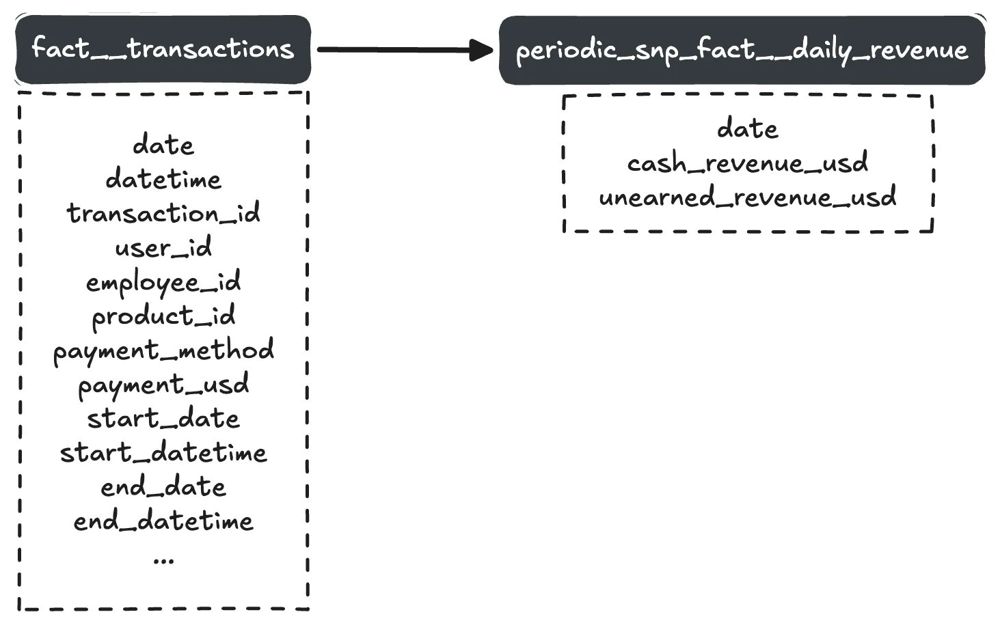
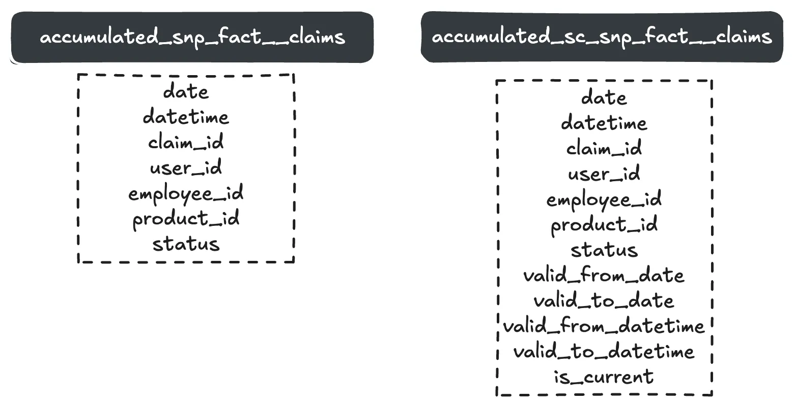
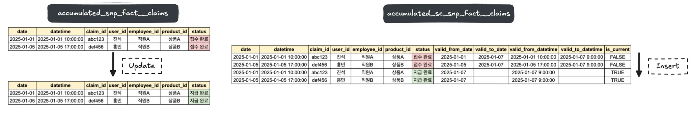

# 📘 보험

---

## 1. 개요: 보험 산업에서의 DW/BI 구축

- **대상 사례**: 자동차, 화재, 생명 보험을 포함한 대형 보험사
- **핵심 목표**: 보험 업무 전반의 데이터를 통합하고, 정확한 분석 체계를 구축
- **특징**: 다양한 내부 업무(보상, 계약, 심사, 마케팅)와 다수의 외부 채널 및 복잡한 상품 구조

---

## 2. 보험 산업의 분석 니즈 및 문제 인식

### 🔍 문제점

| 항목 | 설명 |
| --- | --- |
| 데이터 분산 | 계약, 고객, 영업 채널 등 데이터가 여러 시스템에 흩어져 있음 |
| 데이터 중복 | 부서 간 동일 데이터 중복 추출 및 가공 발생 |
| 정합성 부족 | 운영 시스템 간 불일치로 인해 보고용 데이터에 오류 발생 |
| 구조적 한계 | 상품별, 채널별, 업무별로 별도 시스템 운영 중 |

### 📈 경영진의 요구

- 정확한 **성과 지표** 확보
- 통합된 **정보 분석 체계**
- **고객 중심 분석**으로 전략 전환

---

## 3. 보험 가치사슬과 DW 설계 방향

### 보험 핵심 업무 프로세스

1. **보험 계약 체결**
2. **보험료 수납**
3. **보상 처리**

### 분석 관점

- **계약, 보상 데이터** 상세 분석
- **보장 내역, 보장률, 고객 특성** 등 분석
- **영업 채널 성과** 분석
- **상품별/월별 보험료 분석** (정기구독 유사 구조)

---

## 4. DW 모델링 전략 요약

| 전략 요소 | 설명 |
| --- | --- |
| Periodic Snapshot Fact Table | 보험료 납입 정보를 주기적으로 저장하여 보험 수익 흐름 분석 |
| Role-playing Dimension | 보험 시작일, 종료일 등 기간 속성 재사용 |
| Slowly Changing Dimension (SCD) | 계약자 정보 등 변경 추적 (SCD 적용) |
| Mini Dimension | 고객 세그먼트 등 자주 바뀌는 속성 별도 테이블 구성 |
| Bridge Table | 보장 항목이 여러 개인 상품 (Bridge Table 설계) |
| Degenerate Dimension (DD) | 계약번호 등 분석 가능한 키를 팩트에 포함 |
| Audit Dimension | 로깅, 추적성 확보 (로드 일자, 사용자 등 기록) |
| Junk Dimension | 플래그나 상태코드 등 잡다한 속성 묶기 |
| Conformed Fact/Dimension | 회사 전사에서 일관되게 재사용 가능하도록 설계 |
| Conformed Fact Table | 여러 업무 영역(계약, 보상 등)의 공통 팩트로 통합 |
| Factless Fact Table | 순수 디멘션 간 관계나 이벤트만 존재하는 구조 |
| 설계 실수 방지 | 중복 속성, 잘못된 이력관리 등 피해야 할 설계 체크리스트 적용 |

---

## 5. 보험료 관련 스냅샷 팩트 설계 포인트

- 보험료는 **일시납 → 보험기간에 따라 균등 분배** 필요
- 단순 집계로는 분석 불가, 정확한 수익 분석 위해 납부 건별 데이터 필요
- **납입 경로**(채널, 방법 등)가 다양하므로 원천 시스템 통합 중요
- → Periodic Snapshot Fact Table로 시점별 수납 상태를 기록

---

## 6. 버스 매트릭스 초안 구성

| 팩트 테이블 | 관련 디멘션 |
| --- | --- |
| 보험 트랜잭션 | 계약자, 보장내용, 보장률, 담당자, 보험상품, 기간 등 |
| 보험료 스냅샷 | 계약자, 기간, 상품, 수납 상태 등 |

### **진석 구상해본 사례**



```sql
-- ============================================================
-- periodic_snp_fact__daily_revenue.sql
		-- Table Type: Periodic Snapshot Fact Table (on a daily basis)
		-- Grain: `date`
		-- Partition Key: `date`
		-- Incremental Strategy: insert_overwrite (BigQuery)
-- ============================================================

WITH

-- 현금 흐름 기준 매출
cash_revenue AS (
  SELECT
    date,
    SUM(payment_usd) AS revenue_usd
  FROM
    {{ ref('fact__transactions') }}
  WHERE TRUE
    
			AND (SELECT MAX(date) FROM {{ this }}) < date
    
  GROUP BY
    date
),

-- 모든 거래 내역을 start_date부터 end_date까지 Sequential Dates로 펼치기
unearned_revenue_raw AS (
  SELECT
    DATE_ADD(start_date, INTERVAL days_offset DAY) AS date,
	  DATE_DIFF(end_date, start_date, DAY) + 1 AS total_days,
    payment_usd
  FROM
    {{ ref('fact__transactions') }},
    UNNEST (
	    GENERATE_ARRAY(0, DATE_DIFF(end_date, start_date, DAY))
    ) AS days_offset
  WHERE TRUE
    
	    AND (SELECT max(date) FROM {{ this }}) < DATE_ADD(start_date, INTERVAL days_offset DAY)
    
),

-- 발생 기준 매출
unearned_revenue AS (
  SELECT
    date,
    SUM(payment_usd / total_days) AS revenue_usd
  FROM
    unearned_revenue_raw
  GROUP BY
    date
)

SELECT
  COALESCE(c.date, i.date) AS date,
  COALESCE(c.revenue_usd, 0) AS cash_revenue_usd,
  COALESCE(i.revenue_usd, 0) AS unearned_revenue_usd
FROM
  cash_revenue c
FULL OUTER JOIN
  unearned_revenue i
USING (date)
```

---

# 📘 보험 트랜잭션 모델링

## 1. 보험 트랜잭션 개요

- **보험** = 보장내역들의 묶음 (화재, 절도, 대인배상 등)
- **보장내역** = 하나의 보험에 속한 다양한 **보장 아이템**으로 구성
- **보장 아이템** = 보험사가 판매하는 실제 보험 상품
- **보장범위** = 각 보장 아이템이 실제로 커버하는 영역 (화재/홍수 등)
- **보험 설계사** → 상품 판매
- **언더라이터(Underwriter)** → 최종 승인

### 💡 보험 트랜잭션 팩트의 정의

- **그레인**: *개별 보험 트랜잭션 단위*
- **팩트 예시**: 생성, 변경, 취소, 보상률 산정, 언더라이팅 등
- **디멘션 예시**: 보험 계약자, 담당자, 보장범위, 보장 아이템, 일자(발행/유효), 보험 유형 등

---

## 2. 날짜 디멘션: 🎭 롤플레잉 디멘션 적용

- **발행 일자**와 **유효 일자**는 같은 날짜 디멘션에서 파생
- Kimball 방식: **물리적 디멘션 1개** → **뷰로 복수 역할 제공**

---

## 3. 디멘션 이력 관리: 변경 추적 전략

### 📌 Type 1: 덮어쓰기 (No History)

- 예시: **생일 수정**
- ✔️ 장점: 단순함
- ❌ 단점: 과거 데이터 상실

### 📌 Type 2: 행 추가 (Full History)

- 예시: **우편번호 변경**
- ✔️ 장점: 이력 추적 가능
- ❌ 단점: 테이블 크기 증가 + ETL 복잡도 증가
- 🔁 팩트 테이블은 *구 보험 계약자/신 보험 계약자 대체 키*로 연결

### 📌 Type 3: 이전 값 보존 (Limited History)

- 예시: **보험 계약자 세그먼트 변경**
- ✔️ 장점: 변화 전후 비교 용이
- ❌ 단점: 변경 히스토리가 많을 경우 확장 어려움

---

## 4. 미니 디멘션: 💨 빠르게 변하는 속성 대응

- **적용 대상**: 대용량 + 변경 빈번 디멘션 (예: 보험 계약자)
- **방법**: 자주 변경되는 속성을 별도 **미니 디멘션**에 분리
- ✔️ 팩트와 직접 연결하여 변경 추적 효율화
- 예시: 보장내역의 테스트 결과, 보장 금액 등 기준성 정보

---

## 5. 다중값 디멘션 속성: 🌉 브리지 테이블 활용

- 예시: 기업 고객 ↔ 산업 분류(SIC/NAICS) 관계
- 방법: 브리지 테이블 사용
    - 다대다(M:N) 관계 명확히 표현
    - 산업별 가중치 포함 가능 (농작물 50%, 유제품 30% 등)
- ❗ 표준 분류 누락 시: "알 수 없음(Unknown)" 처리

---

## 6. 수치성 속성 처리 (추후 내용에서 계속)

- 예시: 보장범위 디멘션의 보장 금액 등
- 수치이지만 **기준성 정보**로 쓰이는 경우 디멘션으로 모델링할 수 있음

---

# 📌 정리: 보험 모델링 핵심 전략

| 항목 | 적용 방식 |
| --- | --- |
| 보험 트랜잭션 팩트 | 개별 트랜잭션 단위 |
| 날짜 디멘션 | 롤플레잉 (1개 테이블 → 2개 뷰) |
| 디멘션 이력 관리 | Type 1, 2, 3 선택 적용 |
| 빠른 속성 변경 | 미니 디멘션 적용 |
| 다중 값 속성 | 브리지 테이블 사용 |

# 📘 보험료 주기적 스냅샷 팩트 테이블

---

## 1. 보험료 주기적 스냅샷 팩트 테이블의 필요성

- 보험 트랜잭션 테이블은 **세부적이고 원자적인 데이터**를 보유하여 다양한 분석에 유리하지만, 특정 시점의 **재무 건전성이나 위험 상태** 파악에는 부적합.
- 따라서 **월 단위 요약** 스냅샷 팩트 테이블을 추가 설계하여 기업의 재무 및 리스크 분석을 지원해야 함.

🧱 예:

- `fact_insurance_transaction` → 너무 세분화됨.
- `fact_monthly_premium_snapshot` → 요약된 핵심 지표 중심의 테이블 필요.

---

## 2. 표준 디멘션 구성

스냅샷 팩트 테이블은 아래와 같이 구성한다:

| 포함 | 이유 |
| --- | --- |
| 보험 계약자 디멘션 | 분석 대상의 핵심 |
| 보장 내역 디멘션 | 상품 상세 분석을 위해 필요 |
| 보장 범위 디멘션 | 리스크 범위 측정에 필요 |
| 월 디멘션 | 주기적 스냅샷 특성상 ‘날짜’ 대신 ‘월’ 디멘션 사용 |

| 제외 | 이유 |
| --- | --- |
| 트랜잭션 유형 디멘션 | 월별 스냅샷과 맞지 않음 |
| 모든 직원 역할 디멘션 | 분석 주제가 아님 → 보험 판매인만 포함 |
| 일자 디멘션 | 월 디멘션으로 대체 |

또한, **상태 디멘션**을 새롭게 추가하여 `신규`, `취소`, `유지` 상태 변화를 쉽게 분석할 수 있도록 한다.

---

## 3. 표준 팩트 개념

- 다양한 도메인의 공통된 메트릭은 **표준화된 이름**으로 구성하여 재사용성과 분석 일관성을 확보한다.
- 예시:
    - `written_premium_amount` (액면 보험료 수입)
    - `earned_premium_amount` (실 보험료 수입)

---

## 4. 선납금 팩트와 실매출 계산

- 보험은 **선납 형태**이므로 실제 수익 발생 시점과 금액이 다르다.
- BI 시스템을 통해 복잡한 비즈니스 로직을 반영한 실 매출 분석이 필요함.

| 시점 | 액면 보험료 | 실 보험료 |
| --- | --- | --- |
| 1/1 가입 | 600달러 | 50달러 |
| 2월 | 0달러 | 50달러 |
| 3/31 해지 | -450달러 | 50달러 |
| 4월 이후 | 0달러 | 0달러 |

📌 **Key Insight**

- 액면 보험료는 트랜잭션 발생 시점 기준
- 실 보험료는 기간에 따라 분할 인식됨
- 두 팩트를 분리해서 관리하는 것이 중요함

---

## 5. 슈퍼타입 & 서브타입 팩트 테이블

- **슈퍼타입**: 월별 요약 중심 (`fact_monthly_premium_snapshot`)
- **서브타입**: 상세 트랜잭션 중심 (`fact_insurance_transaction`)

장점:

- 널 값 최소화
- 각 팩트의 목적에 충실한 설계 가능

---

## 6. 다중 값 디멘션과 브리지 테이블

- 자동차 보험의 대표 사례: 한 상품에 여러 운전자가 포함될 수 있음.
- `보험-운전자` 간 **다대다 관계**를 해결하기 위해 **브리지 테이블** 사용.

| 구성 요소 | 설명 |
| --- | --- |
| `bridge_insurance_driver` | 보험 상품과 운전자 간 매핑 테이블 |
| `weighting_factor` | 보험료 배분 가중치 |
| `effective_start_date`, `effective_end_date` | 유효 기간 추적용 컬럼 |

---

## 7. 보험 사례 연구 배경

- 보험업은 **수입보다 보상 지출**이 더 중요한 산업 구조.
- 보험 청구 → 조사 절차 → 외부 전문가 투입 → 실제 보상 진행 → 자산 회수 가능성 존재.
- 보상 전 과정에서 발생하는 트랜잭션 데이터를 **누가 처리했는지(직원 디멘션)** 추적 필요.
- **보상 종료 후에도 추가 보상이 발생할 수 있으므로**, 이 역시 팩트 테이블로 설계되어야 함.

---

# 📘 보상 점진적 스냅샷과 관련 팩트 모델링

## 1️⃣ 개요: 트랜잭션 스키마의 한계를 보완하는 방법

- 트랜잭션 스키마: 운영계 시스템의 가장 디테일한 데이터를 저장
- 문제점: 디테일하더라도 특정 비즈니스 요건(예: 시점별 누적 보상 분석)은 불가능
- 해결책: **점진적 스냅샷 (Accumulative Snapshot)**

---

## 2️⃣ 보상 점진적 스냅샷의 개념과 설계

### 🔸 핵심 개념

- **보상 단위로 데이터를 누적**하며 계속 업데이트되는 구조
- 기간별 누적 지표를 시점 기준으로 저장 → 시간 흐름에 따른 분석 가능
- 그래뉼래러티: “보상 1건” 단위

### 🔸 설계 요소

- 표준 디멘션(보험 계약자, 상품 등) + 기간 디멘션 추가 필요
- 보상 상태 디멘션: 상태 추적 및 분석 용이
- 집계용 수치 데이터 포함 (예: 보상 금액, 처리 시간 등)
- 예외 처리: 휴일 등을 제외한 근무일 기준 분석

---

## 3️⃣ 복잡한 워크플로우 분석을 위한 점진적 스냅샷

### 🔸 용도

- 예측 분석, 프로세스 흐름 추적 등 복잡한 케이스에 적합
- **5~10개 마일스톤 이벤트 일자**로 구성 (시작, 중간, 종료 등)

### 🔸 설계 팁

- 기간 디멘션을 **롤플레잉**으로 설계 (시작일, 종료일 등)
- **단계 간 소요시간 계산**이 중요 (예: A→B, B→C, A→C 등)
- 너무 많은 조합 X → **핵심 이벤트 중심 설계**

---

## 4️⃣ 기간 점진적 스냅샷 (Slowly Changing Snapshot)

### 🔸 문제점 보완

- 일반 점진적 스냅샷은 시점별 "과거 상태" 재현 불가능
- 해결책: **유효기간(start_date, end_date)** 추가

### 🔸 필수 칼럼

- snapshot_start_date
- snapshot_end_date
- is_current_flag

### 🔸 활용 시나리오

- 현재 상태 vs 과거 상태 비교
- 특정 시점 기준 파이프라인 상태 조회 가능

### **진석 구상해본 사례**





| 테이블 이름 | 유형 | 쿼리 부담 | Update 부담 | History 저장 여부 | 가공 배치의 증분 기준 |
| --- | --- | --- | --- | --- | --- |
| `accumulated_snp_fact__claims` | Accumulated Snapshot Fact Table | Rows 수가 적어서 부담 ⬇️ | 테이블 전체를 스캔해야 하므로 부담 ⬆️ | X | ? |
| `accumulated_sc_snp_fact__claims` | Accumulated Slowly Changing Snapshot Fact Table | Rows 수가 많아서 부담 ⬆️ | 단순히 Insert Only만 하므로 부담 ⬇️ | O | `valid_from_date` |

---

## 5️⃣ 점진적 vs 주기적 스냅샷

| 항목 | 점진적 스냅샷 | 주기적 스냅샷 |
| --- | --- | --- |
| 방식 | 누적/업데이트 | 매 주기(예: 월별)로 새 레코드 작성 |
| 적합 사례 | 일반 보상, 단기 처리 | 장기 보상, 신체사고, 재해 등 |
| 포함 데이터 | 현재 상태, 누적 금액 | 기간별 예상금액, 지급금액, 예치금 등 |

---

## 6️⃣ 보험/보상 통합 주기적 스냅샷

### 🔸 목적

- 보험료 매출과 보상금 지출을 **통합 분석**
- 사용자 관점: 수익과 비용의 총합을 보고 싶어 함

### 🔸 통합 팩트 테이블

- 보험과 보상 각각의 팩트 테이블을 통합
- 공통 디멘션 추출 및 공통 그래뉼래러티로 요약
- **드릴어크로스 대신 단일 테이블로 사용자 편의성 향상**

---

## 7️⃣ 팩트 없는 사고 이벤트

### 🔸 정의

- **수치 데이터 없이 이벤트 존재 자체만 기록**하는 테이블
- 예: 사고 발생 자체 (금액 없음)

### 🔸 설계 예시

- 사고 관련자 (loss party) + 역할 (예: 승객, 목격자 등)
- 항상 메트릭은 1 (존재 유무만 표현)
- **다중 값 디멘션** → 브리지 테이블 설계 필수
    - 예: 사고 1건에 여러 관련자 존재 가능

---

# ✅ 다차원 모델링에서 흔히 하는 실수 10가지

---

## ❌ 실수 10: 팩트 테이블에 텍스트 속성 놓기

- **문제 요약**: 분석과 무관한 텍스트 속성을 팩트 테이블에 넣는 경우.
- **왜 실수인가?**
    - 팩트 테이블은 수치형 메트릭 중심 설계가 핵심.
    - 텍스트는 디멘션에 배치해야 한다. 팩트 테이블에 텍스트가 많아지면 저장 공간 낭비 및 쿼리 성능 저하 발생.
- **dbt 모델링 실수 예**
    
    ```sql
    -- 잘못된 팩트 테이블 (텍스트 포함)
    select
      order_id,
      user_id,
      product_name,  -- ❌ 디멘션에 있어야 할 텍스트
      order_amount
    from raw_orders
    ```
    
- **수정 방향**
    - `product_dim` 테이블에 `product_name`을 옮기고, 팩트 테이블에는 외래키만 남긴다.

---

## ❌ 실수 9: 공간 절약을 위해 텍스트성 정보 제한하기

- **문제 요약**: 디멘션 테이블에 텍스트를 너무 축약해서 넣는 경우.
- **왜 실수인가?**
    - 디멘션은 해석 가능한, 풍부한 텍스트 정보를 제공해야 분석이 쉬움.
    - 공간은 디멘션보다 팩트 테이블에서 고민해야 함.
- **dbt 모델링 실수 예**
    
    ```sql
    select
      product_id,
      left(product_name, 5) as product_name_short  -- ❌ 지나치게 축약
    from raw_products
    ```
    
- **수정 방향**
    - 전체 텍스트 저장 및 필요시 alias나 view에서 축약 버전 제공.

---

## ❌ 실수 8: 계층구조를 다수 디멘션으로 분리하기

- **문제 요약**: 계층 구조를 1차 정규화처럼 나눠 설계.
- **왜 실수인가?**
    - 디멘션은 비즈니스 사용자 친화적인 형태여야 하며, 계층은 1개의 테이블에 포함되어야 분석에 용이.
- **dbt 모델링 실수 예**
    
    ```sql
    -- ❌ 계층 분리 예시
    brand_dim (brand_id, brand_name)
    category_dim (category_id, category_name)
    product_dim (product_id, brand_id, category_id, product_name
    ```
    
- **권장 모델**
    
    ```sql
    product_dim (
      product_id,
      product_name,
      brand_name,
      category_name
    )
    ```
    

---

## ❌ 실수 7: 디멘션 이력 추적 무시하기 (SCD 적용 실패)

- **문제 요약**: 디멘션 속성이 변할 때의 이력을 고려하지 않고 항상 최신 정보만 저장.
- **왜 실수인가?**
    - 많은 분석은 "그때 당시"의 디멘션 값 기준으로 분석해야 정확함.
- **dbt 적용 예 (SCD2)**
    - [`dbt_utils.surrogate_key`](https://github.com/dbt-labs/dbt-utils) 활용:
    
    ```sql
    {{ dbt_utils.surrogate_key(['user_id', 'user_email', 'signup_date']) }}
    ```
    

---

## ❌ 실수 6: 성능 이슈를 HW로만 해결하려는 태도

- **문제 요약**: 설계 개선 없이 서버 증설로 해결하려 함.
- **대안**
    - 요약 테이블 작성 (`aggregate_`, `summary_` 접두사)
    - 파티셔닝 전략 적용
    - 필요에 따라 `incremental model`, `pre-aggregated table` 생성
- **dbt 예시**
    
    ```sql
    -- 집계 테이블 예시
    select
      date_trunc('month', order_date) as order_month,
      customer_id,
      sum(order_amount) as total_amount
    from {{ ref('fct_orders') }}
    group by 1, 2
    ```
    

---

## ❌ 실수 5: 운영계 키(스마트 키) 그대로 사용

- **문제 요약**: 운영계 시스템의 복잡한 키를 그대로 사용.
- **권장사항**
    - `surrogate key` (숫자형) 사용 → 디멘션 테이블에서 surrogate key 생성 후 팩트 테이블에서 외래키로 참조
- **dbt 실무 예시**
    
    ```sql
    -- dim_customer 테이블에서 surrogate_key 생성
    row_number() over (partition by customer_id order by updated_at desc) as customer_sk
    ```
    

---

## ❌ 실수 4: 팩트 테이블의 그래뉼래러티(세분성) 정의 없이 조인

- **문제 요약**: 팩트 테이블의 기준(세분성)이 명확하지 않으면, 디멘션과 조인 시 오류 발생.
- **예시**
    - 주문 상세 테이블인데, 고객 디멘션과 일대일 조인을 가정한 경우.
- **dbt에서 주의할 점**
    - `fct_` 모델의 주 키(`primary grain`)를 `unique_key`로 주석에 명시:
    
    ```sql
    -- grain: order_id + product_id
    ```
    

---

## ❌ 실수 3: 정형 보고서 레이아웃대로 모델링

- **문제 요약**: 현업에서 사용하는 엑셀 리포트와 똑같이 모델 설계
- **왜 실수인가?**
    - 리포트는 특정 목적 기반. 다양한 분석에는 유연한 모델 필요.
- **dbt 개선 예시**
    - 비정형 분석도 대응할 수 있도록 가장 낮은 수준의 원시 데이터를 기준으로 모델 작성.
    - 리포트는 BI 툴에서 설계, dbt 모델은 범용성을 고려.

---

## ❌ 실수 2: 사용자가 정규화된 데이터를 조합할 수 있을 거라 기대

- **문제 요약**: 현업 사용자에게 최소 정보만 주고 나머지는 운영계에서 보라고 하는 경우
- **권장사항**
    - 팩트 테이블에 가장 상세한 데이터 수준의 정보를 포함
    - 사용자에게 준비된 데이터 제공
- **dbt 예시**
    
    ```sql
    select
      order_id,
      product_id,
      user_id,
      order_timestamp,
      order_amount
    from {{ source('sales', 'orders_raw') }}
    ```
    

---

## ❌ 실수 1: 표준 팩트와 디멘션 정의 없이 혼용

- **문제 요약**: 동일 이름의 팩트를 다르게 정의하거나, 동일 디멘션이 시스템마다 다르게 사용됨.
- **문제점**
    - 사용자 혼란, 데이터 신뢰도 하락
- **dbt 해결 예시**
    - `fct_sales_system_a`, `fct_sales_system_b`로 분리
    - `dim_date`, `dim_customer` 등 공통 디멘션은 기준 정의 명확히 작성
    - `dbt documentation`을 활용해 팩트/디멘션 정의를 문서화
    
    ```
    version: 2
    
    models:
      - name: fct_sales_system_a
        description: "Sales facts from System A"
        columns:
          - name: total_sales
            description: "Gross sales amount from System A"
    ```
    

---